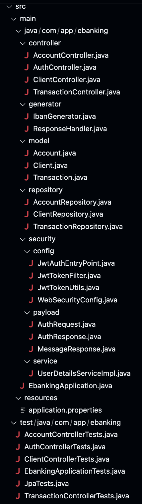
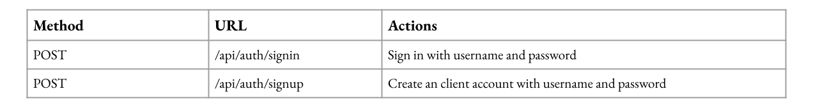
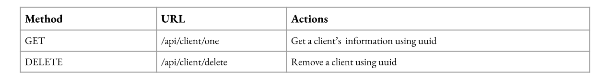
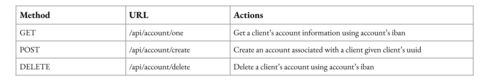
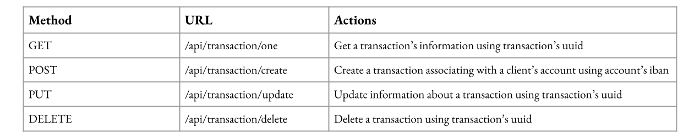
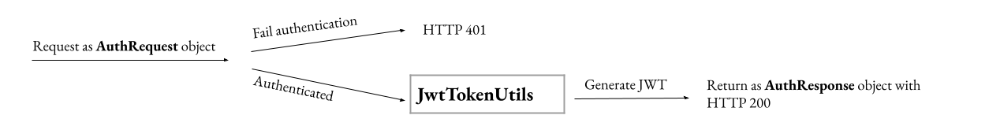
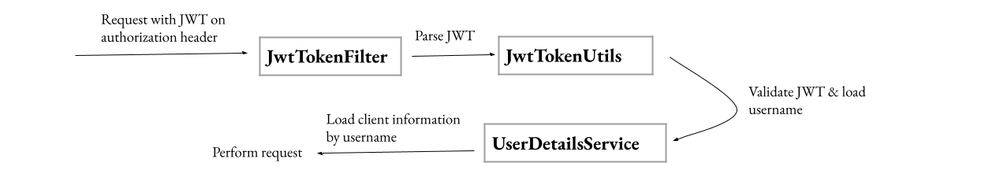

# ***Synpulse8 Backend Hiring Challenge***
## ***Author: Joanna Lin***

### Implementations:
1. Database access: Spring Data JPA
2. Database creation: MySQL
3. Security: Spring Security with JWT
4. Logging: Log4j2
6. Testing: JUnit + Mockito
  

### Code structure diagram: 

  

### Database relationship diagram: 

  

### Endpoint specifications
For authentications: 

  

For client data access: 

  

For account data access: 

  

For transaction data access: 

  

### Authentication Processes
Registration: 

  

Login: 

  

Data accessing: 

