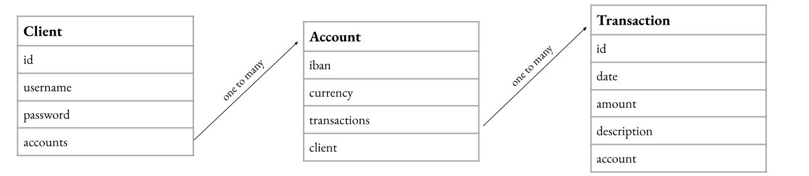

# ***Synpulse8 Backend Hiring Challenge***
## ***Author: Joanna Lin***

### Implementations:
1. Database access: Spring Data JPA
2. Database creation: MySQL
3. Security: Spring Security with JWT
4. Logging: Log4j2
6. Testing: JUnit + Mockito
  
### Database relationship diagram: 

  
### Endpoint specifications
For authentications: 

  
For client data access: 

  
For account data access: 

  
For Transaction data access: 

